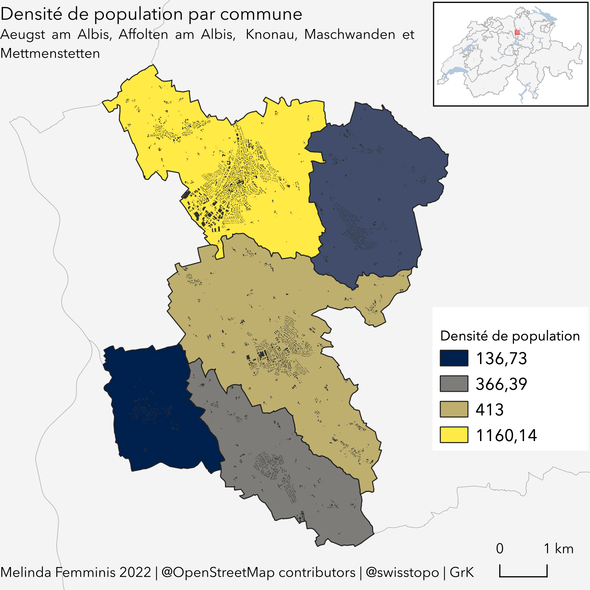
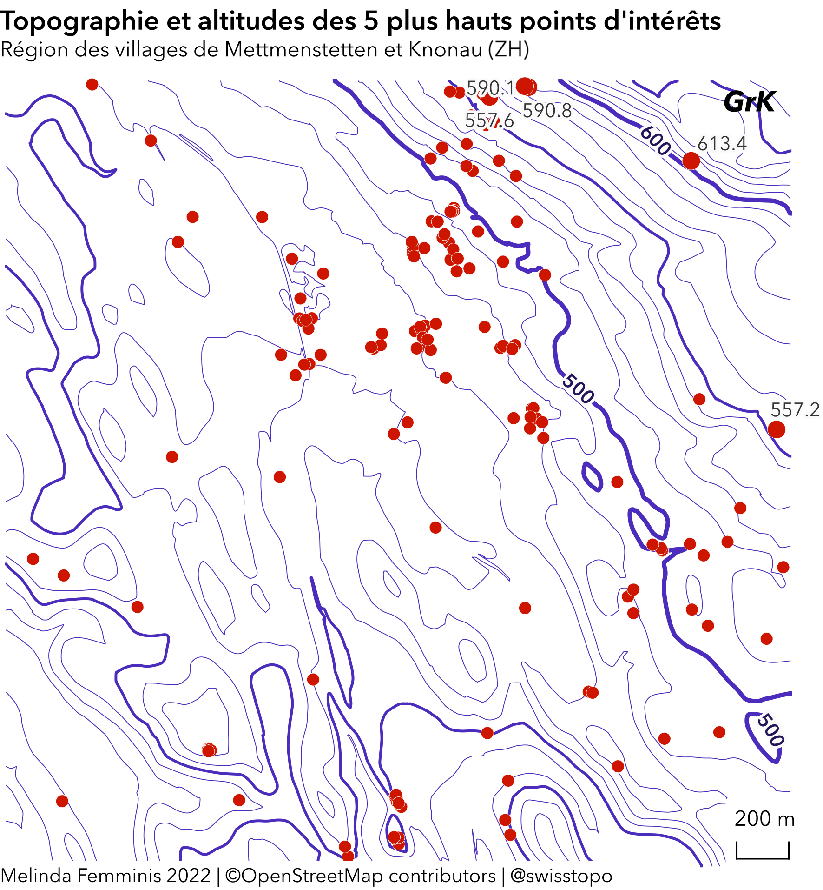
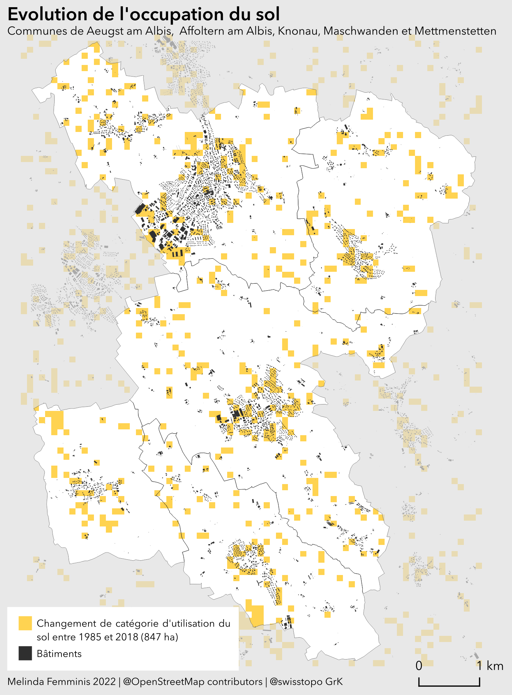
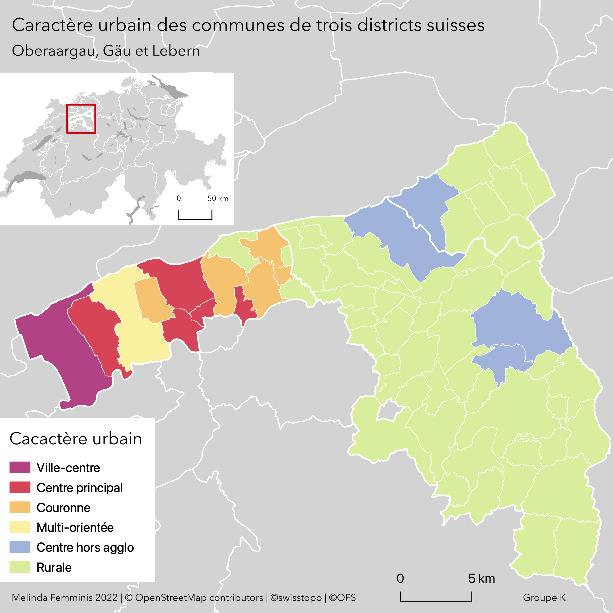
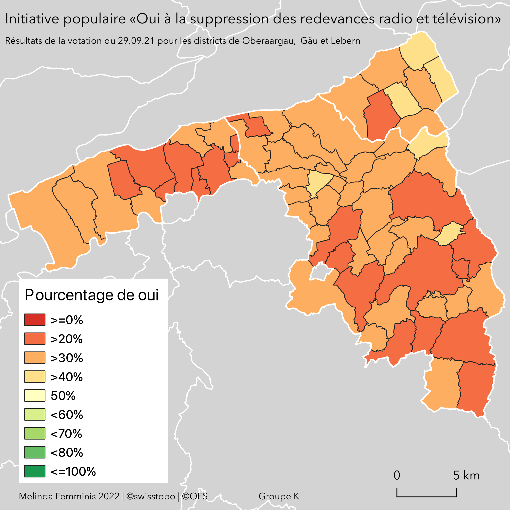

# Cartes avec Qgis 

## Données

Les données proviennent de différentes sources référencées en bas de chaque carte. 

- [Office Fédéral de la Statistique](https://www.bfs.admin.ch/bfs/en/home.html)
- [Office Fédéral de la Topographie](https://www.swisstopo.admin.ch)
- [Open Street Map](https://www.openstreetmap.org/#map=8/46.825/8.224)

## Les cartes

Toutes les cartes ont été faites entièrement dans le logiciel Qgis avec les différentes données mentionnées ci-dessus. 

